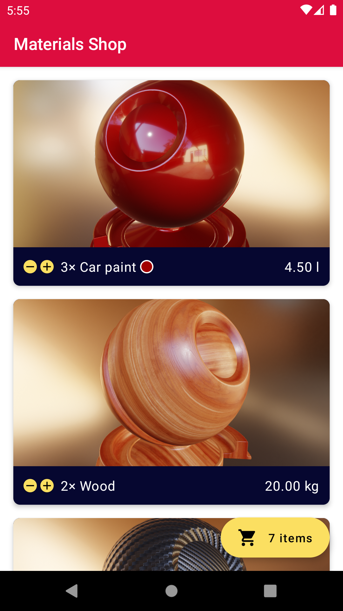

# Materials Shop

Sample app for [Jetpack Compose](https://developer.android.com/jetpack/compose) (`0.1.0-dev15`).
This repository contains the source code of the demo application shown in the following videos:
- [Android 11 Beta: Tools & Frameworks](https://www.youtube.com/watch?v=bAdRKQNbLmQ)
- [Get Composed](https://www.youtube.com/watch?v=U5BwfqBpiWU)

## Requirements

[Android Studio 4.2 Canary](https://developer.android.com/studio/preview) or newer.

## Features and integrations

This sample application shows how to use the following libraries and features:

- [Jetpack Compose Developer Preview 2](https://developer.android.com/jetpack/compose)
  - Scrolling list (`LayColumnItems`)
  - Animations
  - `ConstraintLayout`
  - Interoperability with `android.view`
  - IDE previews
- [Room](https://developer.android.com/topic/libraries/architecture/room): data persistence
- [LiveData](https://developer.android.com/topic/libraries/architecture/livedata): lifecycle-aware observables
- [Filament](https://github.com/google/filament): real-time physically based 3D rendering

## License

The background image [`courtyard_8k`](https://hdrihaven.com/hdri/?h=courtyard) is licensed under
[CC0](https://hdrihaven.com/p/license.php) by Greg Zaal.

Please see [LICENSE](./LICENSE) for the source code's license.
